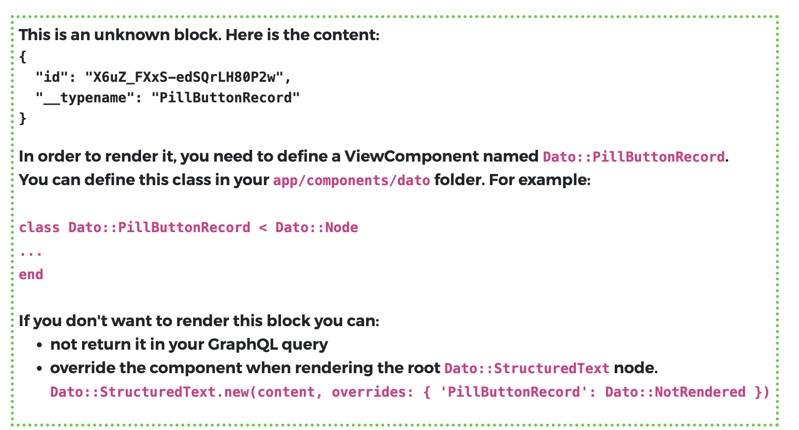

## StructuredText - Nodes

StructuredText is by far one of the most-used features in Dato. Those fields will probably include some custom nodes.
`dato-rails` provides a default implementation for each standard node.
If you define new nodes, you'll have to define an associated ViewComponent to render it.

# Standard nodes

For example, a typical node is `link`. `dato-rails` provides
a [default implementation](../app/components/dato/link.html.erb):

```html
<a href="<URL>" class="dato-cms-link">
    <CHILDREN NODES>
</a>
```

To change how this is rendered you have some options:

1. If you want to change the look and feel of this link, you can use the `dato-cms-link` class and specify your CSS.

1. If you want to change more, you can create a `components/dato/link.html.erb / link.rb` files and completely override
   the implementation.

1. You can also define a new component `Dato::MySpecialLink` and specify that it should be used when rendering a
   specific StructuredText:

```ruby
render Dato::StructuredText.new(content, overrides: { link: Dato::MySpecialLink })
```

4. Finally, you can override it globally:

```ruby
# config/initializers/dato.rb

Dato::Config.overrides = {
  link: 'Dato::MySpecialLink'
}.with_indifferent_access
```

# Custom nodes

StructuredText might return custom nodes. When this happens, a nice message will explain you what to do.



To define a custom node, you can create a new `Dato::CustomNode` view component in your application and it will be
automatically used to render your blocks.

You can also customize how each node type is rendered by specifying the mapping on the single render:

```ruby
render Dato::StructuredText.new(content, 
                                overrides: { "PillButtonRecord" => "Dato::PillButtonRecordV2" })
```

or globally:

```ruby
# config/initializers/dato.rb

Dato::Config.overrides = {
  "PillButtonRecord": "Dato::PillButtonRecordV2"
}.with_indifferent_access
```

inside the ViewComponent, you have a `@node` instance variable with all the data returned by the query.


